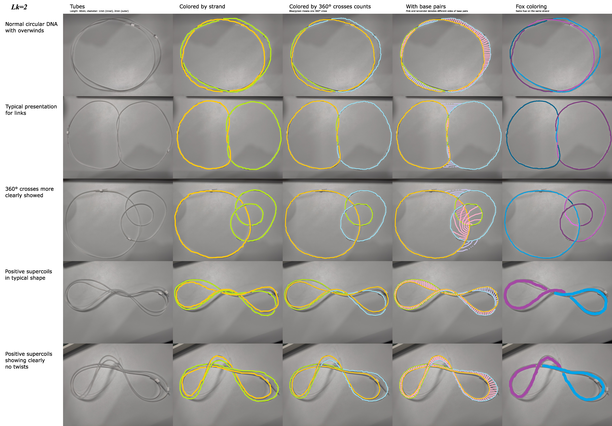

# DNA-topology-illustration
Edited pictures of 2 circular tubes twisted together mimicking a DNA molecule with linking number 2. 

## Features
1. Showing how twist is turned into writhe.
2. Multiple presentations for identical configurations.

## The picture

